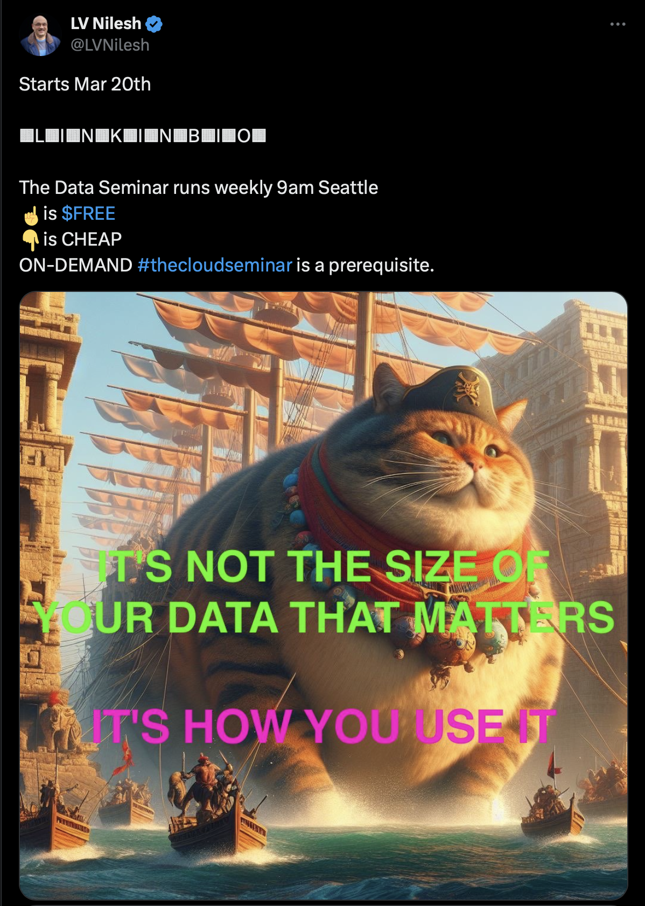

# The Data Seminar

## Managing data:

### Database Management Systems (DBMS)

### Week-01

- AuthZ vs AuthN
- SQL vs NoSQL

- NoSQL

  - mongodb
  - hadoop
  - aerospike
  - elastic search
  - redis (cache and db)
  - cassandra
  - scylla

- SQL

  - MySQL
  - MariaDB
  - Postgres
  - MS SQL
  - Oracle

- Understanding Nosql records/documents
- JSON vs BSON https://www.mongodb.com/basics/bson

- Hands on MongoDB and Mongo-Express
- Hands on Mariadb and Adminer
- SQLite and https://sqlitebrowser.org

### Week-02

- Indexing and Transactions

Indexing is the process of organizing and categorizing data in a database or information system, making it easier to search, retrieve, and access the information. Indexing involves creating an index, which is a data structure that maps the search terms to their corresponding data records. This allows for faster and more efficient searching and retrieval of data, as the index provides a direct reference to the data without having to search through the entire database. Indexing is commonly used in databases, search engines, and other information systems to improve the speed and accuracy of information retrieval.

Transactions are a way of ensuring data integrity and consistency in a database. A transaction is a group of one or more database operations that are executed as a single unit of work. Transactions are used to ensure that either all of the operations in the group are completed successfully, or none of them are completed. This helps to prevent data inconsistencies and ensures that the database remains in a consistent state.

- What are file descriptors and how they relate to DB performance?

File descriptors are a way for a program to access a file or other resource on a computer's file system. They are used by the operating system to keep track of the open files and their status.

In the context of database performance, file descriptors can be used to optimize the way a database reads and writes data to disk. For example, a database can use file descriptors to open a file in a way that allows it to read data from the file in a more efficient way than if it simply opened the file as a regular file.

Additionally, file descriptors can be used to manage the number of open files that a database has. By keeping track of the number of open files, a database can ensure that it does not run out of resources and that it can continue to operate efficiently.

- MySQL Configuration, Backup and Recovery
- Server logs, Database replication
- CAP theorem in NoSQL, Distributed system/database
- Data Partitioning, Sharding and Replicasets
- Consistent Hashing and Quorums in NoSQL

#### SQL vs. NoSQL: Understanding the differences

- What is SQL
- What is NoSQL
- Why do we need a Schema?
- Schema on read (SQL) versus Schema on Write (NoSQL)

#### JSON and BSON

https://www.mongodb.com/basics/bson

### primitive datastores

- store stuff in a file, sqlite

### database systems

- Trade-offs Between SQL and NoSQL:

- Analyzing the trade-offs in performance, scalability, and consistency

- Use cases best suited for SQL vs. NoSQL

### Deep Dive into NoSQL Databases:

- Types of NoSQL databases: Key-Value, Document, Column, Graph

- Popular NoSQL databases: MongoDB, Redis, Cassandra

- Real-world applications of NoSQL

### NoSQL Database Uses in Scalability and High Availability

(WHY use NoSQL)

- Scalability challenges and solutions in NoSQL

- High availability concepts in NoSQL databases

- Replication and sharding

### Enterprise Solutions and NoSQL (HOWs and WHYs):

- Overview of enterprise NoSQL solutions: Aerospike, Cassandra, Elasticsearch etc

- How enterprises utilize NoSQL for performance and scalability

### System Design Concepts around NoSQL

- Data modeling for NoSQL databases

- Indexing strategies in NoSQL

- Partitioning and sharding in detail

### Database Internals:

- Understanding the internals of SQL and NoSQL databases

- Storage engines: How data is stored and retrieved

- The role of caching in database performance

### Distributed Systems and Databases:

- Fundamentals of distributed systems

- The role of databases in distributed architectures

- current trends in distributed databases

### Cache databases

- How do Cache databases work.

- How to implement Redis.
