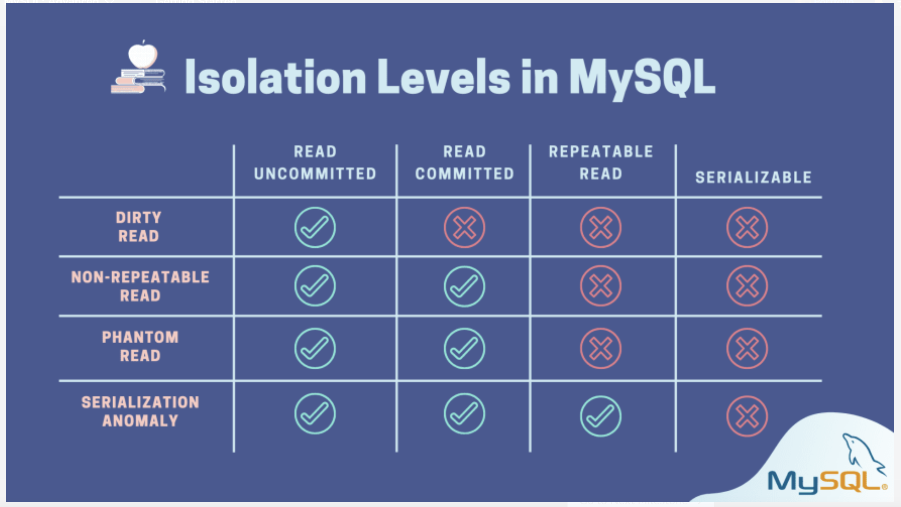

#### Indexing:

Indexing is the process of organizing and categorizing data in a database or information system, making it easier to search, retrieve, and access the information. Indexing involves creating an index, which is a data structure that maps the search terms to their corresponding data records. This allows for faster and more efficient searching and retrieval of data, as the index provides a direct reference to the data without having to search through the entire database. Indexing is commonly used in databases, search engines, and other information systems to improve the speed and accuracy of information retrieval.

#### Transactions:

Transactions are a way of ensuring data integrity and consistency in a database. A transaction is a group of one or more database operations that are executed as a single unit of work. Transactions are used to ensure that either all of the operations in the group are completed successfully, or none of them are completed. This helps to prevent data inconsistencies and ensures that the database remains in a consistent state.

#### Isolation levels:

Isolation levels in database systems help solve concurrency problems by determining the degree to which one transaction is isolated from the effects of other concurrent transactions. By defining strict rules for data access and modification, isolation levels ensure data consistency and integrity in a multi-user environment.



#### File descriptors:

File descriptors are an index into a file descriptor table stored by the kernel. The kernel creates a file descriptor in response to an open call and associates the file descriptor with some abstraction of an underlying file-like object, be that an actual hardware device, or a file system or something else entirely. Consequently a process's read or write calls that reference that file descriptor are routed to the correct place by the kernel to ultimately do something useful.

It is simply an integer number that uniquely represents an opened file.

Every running program starts with three files already opened:

```
Standard In	        stdin	0		Input from the keyboard
Standard Out		stdout	1		Output to the console
Standard Error		stderr	2		Error output to the console

ls -la /dev/stdin  /dev/stdout /dev/stderr

lrwxrwxrwx 1 root root 15 Feb 29 01:10 /dev/stdin -> /proc/self/fd/0
lrwxrwxrwx 1 root root 15 Feb 29 01:10 /dev/stdout -> /proc/self/fd/1
lrwxrwxrwx 1 root root 15 Feb 29 01:10 /dev/stderr -> /proc/self/fd/2
```

These entry numbers 0, 1, 2, etc. are the file descriptors.

Count the number of open files on a given system

```
# This script may need sudo

sum=0
for pid in /proc/[0-9]*; do
  # Count the number of files in the process's fd directory
  count=$(ls -l $pid/fd | wc -l)
  # Subtract 2 to exclude '.' and '..' entries
  count=$((count - 2))
  sum=$((sum + count))
done
echo "Total open files: $sum"
```

When you open a file, the operating system creates an entry to represent that file and store the information about that opened file. So if there are 100 files opened in your OS then there will be 100 entries in OS.

#### Socket Descriptor:

When you open a network socket, it is also represented by an integer and it is called Socket Descriptor.

Read more https://www.bottomupcs.com/index.html

#### Impact on Database Performance:

Databases often rely on file system access for various reasons:

- Reading/writing data from/to database files.
- Accessing temporary files during operations.
- Logging database activity.

#### Limitations

The number of available file descriptors on a Linux system depends on two limits:

- Soft Limit: This is a per-user (or per-process) limit that can be adjusted dynamically. You can check the current soft limit for the user you're logged in with using the `ulimit -n` command:

```
ulimit -n
```

- Hard Limit: This is a system-wide limit set by the administrator and represents the maximum allowed file descriptors for any user. You can't directly view this limit using a user command, but some system information tools might reveal it.

Kernel Parameter (/proc/sys/fs/file-max): This file in the /proc filesystem shows the system's global maximum number of file descriptors. However, this doesn't necessarily reflect the actual available count, as some might be reserved by the kernel or other processes.

```
cat /proc/sys/fs/file-max
```

If a database application opens too many files (due to high connection volume, frequent temporary files, etc.), it can:

- Run out of available FDs, leading to errors or performance degradation.
- Increase context switching overhead as the system juggles limited resources.

Here's how excessive FDs can affect DB performance:

- Slowed Down Operations: When the database needs an FD but none are available, it might have to wait for another process to close a file, causing delays in database operations like queries and data manipulation.
- Increased System Load: Managing a large number of open files puts a strain on the operating system's resource management, leading to overall system slowdown.

#### Optimizing for Performance:

- Database Configuration: Some databases allow configuration options to control how many temporary files are created or how connections are pooled. Tuning these settings can help reduce FD usage.

- Application Design: Efficient application design that minimizes unnecessary file operations can help keep FD usage in check. Consider connection pooling and caching strategies.

```
sudo apt install lsof -y
```

- System Monitoring: Monitor system resource usage, including the number of open file descriptors, to identify potential bottlenecks. Operating system tools like lsof (list open files) can be helpful.

#### MariaDB database replication

MariaDB supports several methods for database replication, each offering different characteristics:

- Asynchronous Replication (Most Common):

This is the most widely used method. Changes are written to the binary log on the master server and then asynchronously applied to the slave server at a later time. Offers good performance as the master and slave don't need to be in sync constantly, but there can be a slight delay in data being reflected on the slave.

- Semi-synchronous Replication:

Provides a balance between performance and data consistency. Data is written to the binary log on the master and then acknowledged by at least one slave before the write is committed on the master. Offers a faster recovery time in case of a master failure compared to asynchronous replication, but with slightly more overhead.

- Galera Cluster (Synchronous Replication):

This is a multi-master replication approach using the Galera library for group communication. All nodes in the cluster have a copy of the database and maintain consistency through a consensus algorithm. Offers high availability and data consistency, but can have higher resource requirements and potentially slightly lower performance compared to asynchronous methods.

- Multi-source Replication:

Allows replicating data from multiple master servers to a single slave server. Useful for scenarios where data originates from different sources. Requires more complex configuration but can be helpful in specific use cases.

#### Choosing the Right Method:

The best replication method depends on your specific needs:

- Performance requirements: How critical is it to have the latest data on the slave?
- Data consistency: How important is it to guarantee that data on the master and slave are always identical?
- Availability: How important is it to have a highly available database setup?
- Complexity: How comfortable are you with managing a more complex replication configuration?

For most basic scenarios, asynchronous replication is a good starting point due to its simplicity and good performance. If you need more immediate data consistency or higher availability, explore semi-synchronous replication or Galera Cluster. Multi-source replication is more specific to situations with multiple data sources.
