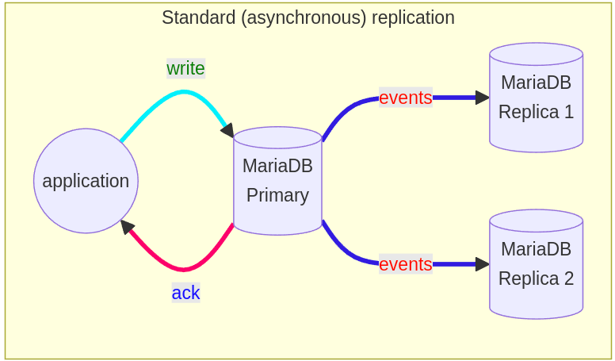
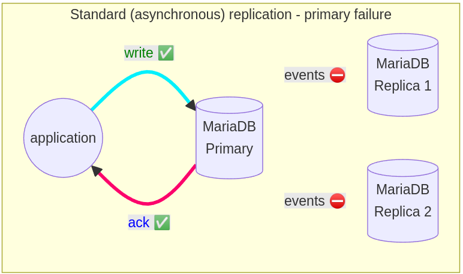

https://mariadb.org/mariadb-replication-using-containers/



#### Standard or asynchronous or lazy replication.

The problem with this type of replication is potential data loss if the primary goes down. Transactions that are committed on the primary are not being sent to replicas, and the replica doesn’t commit the changes. Failover from primary to replica in this case may lead to missing transactions relative to the primary.



To overcome these type of errors, there is:

- semi-sync replication that is integrated into MariaDB since 10.4
- full sync replication, which MariaDB plans to implement eventually as MDEV-19140.
- another option is to use Galera.

While in fully sync replication all replicas have to verify a single transaction before the primary returns to the session that executed the transaction, in semi-sync replication at least one replica needs to acknowledge that the transaction event is transmitted successfully. That gives faster replication compared to fully-sync replication.

Compared to async replication, semi-sync replication provides improved data integrity, because when the primary receives acknowledgment from at least one replica and commits the changes, we can be sure that the data exists in at least 2 places.

#### Download

```
wget https://raw.githubusercontent.com/shivanand-patil/TheDataSeminar/main/Week-02/exercises/mariadb-replication-async/.env
wget https://github.com/shivanand-patil/TheDataSeminar/blob/main/Week-02/exercises/mariadb-replication-async/docker-compose.yaml
```

Create a master and two replicas

```
docker compose up -d

docker compose ps

```

Check primary status (check position in the binlog as well as the name of the binlog).

```
docker exec mariadb-primary mariadb -uroot -psecret -e "show master status\G;"
```

Check databases for replication

```
docker exec -it mariadb-primary mariadb -uroot -psecret -e "show databases like '%test%'";
```

Check binary logs

```
docker exec --workdir /var/lib/mysql mariadb-primary bash -c "ls maria*"
```

The same can be seen from the mariadb client

```
docker exec mariadb-primary mariadb -uroot -psecret -e "show binary logs\G;"
```

example of fresh start

```
docker exec mariadb-primary mariadb-binlog /var/lib/mysql/mariadb-bin.000002
```

Check replicated database

```
docker exec -it mariadb-replica-1 mariadb -uroot -psecret -e "show databases like '%test%'";
docker exec -it mariadb-replica-2 mariadb -uroot -psecret -e "show databases like '%test%'";
```

Transaction:

```
CREATE TABLE `t` (
  `t` char(15) NOT NULL
);

INSERT INTO `t` (`t`)
VALUES ('Nilesh');

INSERT INTO `t` (`t`)
VALUES ('Ayaan');

INSERT INTO `t` (`t`)
VALUES ('Vikas');

INSERT INTO `t` (`t`)
VALUES ('Sahil');

INSERT INTO `t` (`t`)
VALUES ('Shivanand');
```

validate the binlog using the mariadb-binlog client (binlog below),

```
docker exec -it mariadb-primary mariadb -uroot -psecret -e "show master status;"
docker exec mariadb-primary mariadb-binlog /var/lib/mysql/mariadb-bin.000002

```

INSERT VALUES using adminer

and

results of replication, validated on the replica (replica below).

```
docker exec -it mariadb-replica-1 mariadb -uroot -psecret -e "show replica status \G;"
docker exec -it mariadb-replica-2 mariadb -uroot -psecret -e "show replica status \G;"

```

Check the content of the table t in test database

```
docker exec -it mariadb-replica-1 mariadb -uroot -psecret -e "use testdb; show tables; show create table t;"
docker exec -it mariadb-replica-2 mariadb -uroot -psecret -e "use testdb; show tables; show create table t;"

docker exec -it mariadb-primary mariadb -uroot -psecret -e "show master status;"

docker exec -it mariadb-replica-1 mariadb -uroot -psecret -e "select * from testdb.t"
docker exec -it mariadb-replica-2 mariadb -uroot -psecret -e "select * from testdb.t"
```

Show replica hosts

```
docker exec -it mariadb-primary mariadb -uroot -psecret -e "SHOW REPLICA HOSTS;"
```

Destroy everything

```
docker compose down --remove-orphans
```
